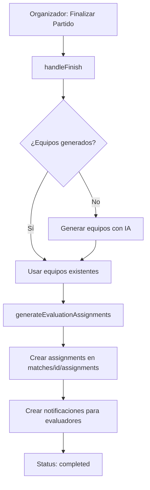
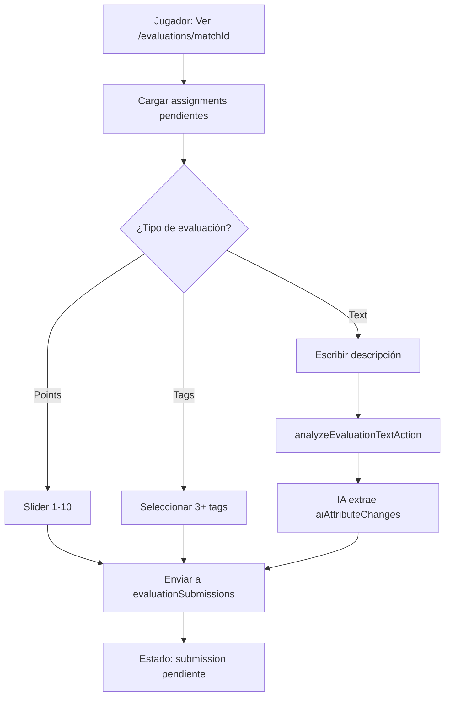
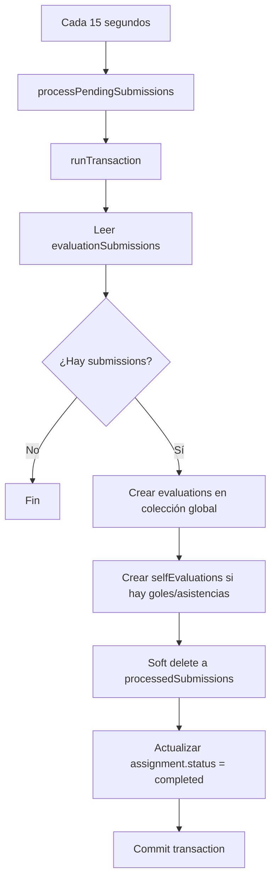
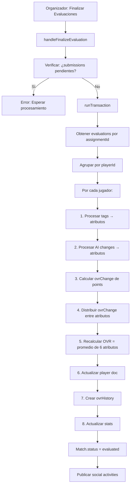

# 🔍 CORRECCIÓN: Análisis Real del Sistema de Evaluaciones - Pateá

**Fecha**: 3 de Febrero 2026  
**Revisión**: Análisis meticuloso del código real vs documentación

---

## ⚠️ DISCREPANCIAS CRÍTICAS ENCONTRADAS

### 1. **TRES Tipos de Evaluación, NO Dos**

**Documentación decía**: 2 métodos (Puntos y Etiquetas)

**REALIDAD**:
```typescript
evaluationType: 'points' | 'tags' | 'text'  // ← TERCER TIPO: TEXT/AI
```

**Archivos afectados**:
- [types.ts:518](file:///d:/Pateá/src/lib/types.ts#L518) - Define 3 tipos
- [evaluate/page.tsx:195-204](file:///d:/Pateá/src/app/matches/[id]/evaluate/page.tsx#L195-L204) - Procesa evaluaciones de texto
- [evaluation-actions.ts](file:///d:/Pateá/src/lib/actions/evaluation-actions.ts) - Action para analizar texto con IA

**Cómo funciona el tipo TEXT**:
1. Usuario escribe descripción textual del rendimiento
2. Se llama a [analyzeEvaluationTextAction()](file:///d:/Pate%C3%A1/src/lib/actions/evaluation-actions.ts#15-37)
3. IA extrae cambios de atributos con `analyze-text-performance` flow
4. Se guarda `aiAttributeChanges`, `aiConfidence`, `aiSummary`
5. En finalización, se procesan como cambios directos a atributos

---

### 2. **Ubicación de Evaluations: Colección Global**

**Documentación decía**: `/matches/{matchId}/evaluations/{playerId}`

**REALIDAD**:
```typescript
// Evaluations se guardan en colección GLOBAL
const evalRef = doc(collection(firestore, 'evaluations'));
```

**Evidencia**:
- [evaluate/page.tsx:181](file:///d:/Pateá/src/app/matches/[id]/evaluate/page.tsx#L181) - Crea en colección global
- [evaluate/page.tsx:304](file:///d:/Pateá/src/app/matches/[id]/evaluate/page.tsx#L304) - Query filtra por `assignmentId`
- [server-actions.ts:94](file:///d:/Pateá/src/lib/actions/server-actions.ts#L94) - Lee de colección global

**Estructura real**:
```
evaluations/{evaluationId}
  - assignmentId: string
  - playerId: string
  - evaluatorId: string
  - matchId: string
  - rating?: number
  - performanceTags?: PerformanceTag[]
  - textDescription?: string
  - aiAttributeChanges?: AttributeChange[]
  - aiConfidence?: number
  - aiSummary?: string
```

---

### 3. **Asignaciones: Lógica Sofisticada con Fallbacks**

**Documentación decía**: "Cada jugador evalúa ~2 compañeros de equipo"

**REALIDAD** ([use-match-actions.ts:45-104](file:///d:/Pateá/src/hooks/use-match-actions.ts#L45-L104)):

```typescript
const generateEvaluationAssignments = (match, allPlayers) => {
  // 1. Solo usuarios reales pueden ser evaluadores (no jugadores manuales)
  const realPlayerUids = matchPlayers.filter(isRealUser).map(p => p.id);
  
  // 2. TODOS los jugadores pueden ser evaluados (incluye manuales)
  const allPeers = matchPlayers.filter(p => p.id !== evaluatorId);
  
  // 3. Prioridad: Compañeros de equipo > Rivales
  const teammates = allPeers.filter(p => myTeam?.players.some(tp => tp.uid === p.id));
  const others = allPeers.filter(p => !myTeam?.players.some(tp => tp.uid === p.id));
  
  // 4. Estrategia: Hasta 2 peers
  const MAX_PEERS = 2;
  
  // A. Shuffle y selecciona compañeros de equipo primero
  selectedPeers.push(...shuffledTeammates.slice(0, MAX_PEERS));
  
  // B. Si faltan, completa con rivales
  if (selectedPeers.length < MAX_PEERS && others.length > 0) {
    selectedPeers.push(...shuffledOthers.slice(0, remainingSlots));
  }
  
  // 5. FALLBACK CRÍTICO: Si no hay peers, auto-evaluación
  if (selectedPeers.length === 0) {
    assignments.push({
      evaluatorId: evaluatorId,
      subjectId: evaluatorId,  // ← Se evalúa a sí mismo
      status: 'pending'
    });
  }
};
```

**Consideraciones especiales**:
- ✅ **Shuffle aleatorio** para equidad
- ✅ **Prioriza compañeros** de equipo
- ✅ **Fallback a auto-evaluación** si no hay nadie más
- ✅ **Solo usuarios reales** evalúan (no jugadores manuales)
- ✅ **Todos pueden ser evaluados** (incluye manuales)

**Cuándo se crean**: Al finalizar el partido ([use-match-actions.ts:148-176](file:///d:/Pateá/src/hooks/use-match-actions.ts#L148-L176))

---

### 4. **Procesamiento Automático Cada 15 Segundos**

**Documentación NO mencionaba**: Polling automático

**REALIDAD** ([evaluate/page.tsx:228-238](file:///d:/Pateá/src/app/matches/[id]/evaluate/page.tsx#L228-L238)):

```typescript
useEffect(() => {
  if (match && match.status !== 'evaluated') {
    const interval = setInterval(() => {
      processPendingSubmissions();  // ← Auto-procesa cada 15s
    }, 15000);
    
    processPendingSubmissions(); // También ejecuta al cargar
    
    return () => clearInterval(interval);
  }
}, [match, processPendingSubmissions]);
```

**Implicaciones**:
- ⚡ **Procesamiento casi en tiempo real** sin intervención del organizador
- 🔄 **Auto-actualización** de la UI del panel de supervisión
- 📊 **Progreso visible** sin necesidad de refrescar página

---

### 5. **Soft Delete a `processedSubmissions`**

**Documentación decía**: Soft delete implementado

**REALIDAD CONFIRMADA** ([evaluate/page.tsx:153-163](file:///d:/Pateá/src/app/matches/[id]/evaluate/page.tsx#L153-L163)):

```typescript
// ✅ SOFT DELETE: Move to processedSubmissions
const processedRef = doc(collection(firestore, `matches/${matchId}/processedSubmissions`));
transaction.set(processedRef, {
  ...submissionData,
  processedAt: new Date().toISOString(),
  originalSubmissionId: submissionDoc.id,
  processingStatus: 'completed',
});

// Delete original (data preserved above)
transaction.delete(submissionDoc.ref);
```

**Ubicación**:
```
matches/{matchId}/processedSubmissions/{submissionId}
  - (todos los campos originales)
  - processedAt: string
  - originalSubmissionId: string
  - processingStatus: 'completed'
```

---

### 6. **Cálculo de OVR: SIEMPRE Promedio de Atributos**

**Documentación decía**: OVR se calcula y se aplica cambio

**REALIDAD** ([evaluate/page.tsx:366-368](file:///d:/Pateá/src/app/matches/[id]/evaluate/page.tsx#L366-L368)):

```typescript
// ✅ STEP 4: Calculate new OVR as average of updated attributes (ALWAYS CONSISTENT)
let newOvr = Math.round((updatedAttributes.pac + updatedAttributes.sho + 
                         updatedAttributes.pas + updatedAttributes.dri + 
                         updatedAttributes.def + updatedAttributes.phy) / 6);
newOvr = Math.max(OVR_PROGRESSION.MIN_OVR, Math.min(OVR_PROGRESSION.HARD_CAP, newOvr));
```

**Flujo completo**:
1. **Tags** → Modifican atributos específicos
2. **Text/AI** → Modifican atributos específicos
3. **Points** → Calculan `ovrChange`, distribuyen proporcionalmente entre 6 atributos
4. **Recalcular OVR** → SIEMPRE como promedio de los 6 atributos finales

---

### 7. **Progresión de OVR: Sistema de Decay Complejo**

**Documentación NO detallaba**: Fórmula de progresión

**REALIDAD** ([evaluate/page.tsx:28-54](file:///d:/Pateá/src/app/matches/[id]/evaluate/page.tsx#L28-L54)):

```typescript
const OVR_PROGRESSION = {
  BASELINE_RATING: 5,      // Rating neutro
  SCALE: 0.6,              // Multiplicador base
  MAX_STEP: 2,             // Máximo cambio por partido
  DECAY_START: 70,         // Inicio del decay
  SOFT_CAP: 95,            // Cap suave
  HARD_CAP: 99,            // Cap duro
  MIN_OVR: 40,
  MIN_ATTRIBUTE: 20,
  MAX_ATTRIBUTE: 90
};

const calculateOvrChange = (currentOvr, avgRating) => {
  if (avgRating === 5) return 0;  // Rating neutro = sin cambio
  
  const ratingDelta = avgRating - 5;
  let rawDelta = ratingDelta * 0.6;
  
  // Decay progresivo
  if (currentOvr >= 70) {
    if (currentOvr < 95) {
      // Decay suave: reduce hasta 60%
      const t = (currentOvr - 70) / (95 - 70);
      rawDelta *= 1 - (0.6 * t);
    } else {
      // Decay fuerte: reduce hasta 75%
      const t = (currentOvr - 95) / (99 - 95);
      rawDelta *= 0.25 * (1 - t);
    }
  }
  
  return Math.round(Math.max(-2, Math.min(2, rawDelta)));
};
```

**Ejemplos**:
- OVR 50, Rating 8 → +1.8 → **+2**
- OVR 70, Rating 8 → +1.8 (inicio decay) → **+2**
- OVR 85, Rating 8 → +1.8 * 0.4 → **+1**
- OVR 96, Rating 8 → +1.8 * 0.1 → **+0**

---

### 8. **Self-Evaluations: Goles y Asistencias**

**Documentación NO mencionaba**: Subcollection separada

**REALIDAD** ([evaluate/page.tsx:168-177](file:///d:/Pateá/src/app/matches/[id]/evaluate/page.tsx#L168-L177)):

```typescript
// Create self-evaluation if player contributed
if (formData.evaluatorGoals > 0 || formData.evaluatorAssists > 0) {
  const selfEvalRef = doc(collection(firestore, `matches/${matchId}/selfEvaluations`));
  transaction.set(selfEvalRef, {
    playerId: evaluatorId,
    matchId,
    goals: formData.evaluatorGoals,
    assists: formData.evaluatorAssists || 0,
    reportedAt: submissionData.submittedAt,
  });
}
```

**Ubicación**:
```
matches/{matchId}/selfEvaluations/{selfEvalId}
  - playerId: string
  - matchId: string
  - goals: number
  - assists: number
  - reportedAt: string
```

**Uso**: Se consulta en finalización para actualizar stats del jugador

---

## 📊 FLUJO REAL COMPLETO

### Fase 1: Finalización del Partido



### Fase 2: Evaluación de Jugadores



### Fase 3: Procesamiento Automático



### Fase 4: Finalización de Evaluaciones



---

## 🗂️ MODELO DE DATOS REAL

### EvaluationSubmission (Temporal)
**Ubicación**: `evaluationSubmissions/{id}` (colección global)

```typescript
{
  id: string;
  evaluatorId: string;
  matchId: string;
  submittedAt: string;
  submission: {
    evaluatorGoals: number;
    evaluatorAssists: number;
    evaluations: PlayerEvaluationFormData[];
  }
}
```

### Evaluation (Permanente)
**Ubicación**: `evaluations/{id}` (colección global)

```typescript
{
  id: string;
  assignmentId: string;
  playerId: string;
  evaluatorId: string;
  matchId: string;
  goals: number;
  
  // Tipo POINTS
  rating?: number;  // 1-10
  
  // Tipo TAGS
  performanceTags?: PerformanceTag[];
  
  // Tipo TEXT/AI
  textDescription?: string;
  aiSummary?: string;
  aiAttributeChanges?: AttributeChange[];
  aiConfidence?: number;
  
  evaluatedAt: string;
}
```

### EvaluationAssignment
**Ubicación**: `matches/{matchId}/assignments/{id}`

```typescript
{
  id: string;
  matchId: string;
  evaluatorId: string;
  subjectId: string;
  status: 'pending' | 'completed';
  evaluationId?: string;  // Referencia a evaluation cuando se completa
}
```

### SelfEvaluation
**Ubicación**: `matches/{matchId}/selfEvaluations/{id}`

```typescript
{
  id: string;
  playerId: string;
  matchId: string;
  goals: number;
  assists: number;
  reportedAt: string;
}
```

### ProcessedSubmission (Auditoría)
**Ubicación**: `matches/{matchId}/processedSubmissions/{id}`

```typescript
{
  // Todos los campos de EvaluationSubmission +
  processedAt: string;
  originalSubmissionId: string;
  processingStatus: 'completed';
}
```

---

## 🛡️ SISTEMAS DE SEGURIDAD Y FALLBACKS

### 1. **Prevención de Race Conditions**

```typescript
// ✅ runTransaction garantiza atomicidad
await runTransaction(firestore, async (transaction) => {
  // Firestore maneja conflictos automáticamente
  // Si dos transacciones modifican lo mismo, una se reintenta
});
```

### 2. **Verificación Pre-Finalización**

```typescript
// ✅ Verifica que no haya submissions pendientes
const pendingSubmissionsSnapshot = await getDocs(pendingSubmissionsQuery);
if (!pendingSubmissionsSnapshot.empty) {
  throw new Error(`Aún hay ${pendingSubmissionsSnapshot.size} evaluaciones pendientes`);
}
```

### 3. **Validación Estricta con Zod**

```typescript
// ✅ discriminatedUnion fuerza validación por tipo
const playerEvaluationSchema = z.discriminatedUnion('evaluationType', [
  z.object({
    evaluationType: z.literal('points'),
    rating: z.coerce.number().min(1).max(10),  // OBLIGATORIO
  }),
  z.object({
    evaluationType: z.literal('tags'),
    performanceTags: z.array(...).min(3),  // OBLIGATORIO
  }),
]);
```

### 4. **Fallback de Auto-Evaluación**

```typescript
// ✅ Si no hay peers, se asigna auto-evaluación
if (selectedPeers.length === 0) {
  assignments.push({
    evaluatorId: evaluatorId,
    subjectId: evaluatorId,  // Se evalúa a sí mismo
  });
}
```

### 5. **Límites de Progresión**

```typescript
// ✅ Caps en atributos
newAttributes[attr] = Math.max(20, Math.min(90, newValue));

// ✅ Caps en OVR
newOvr = Math.max(40, Math.min(99, newOvr));
```

---

## 🎯 CONCLUSIONES

### Errores en el Análisis Original

1. ❌ **Omitió el tercer tipo de evaluación** (TEXT/AI)
2. ❌ **Ubicación incorrecta de evaluations** (global vs subcollection)
3. ❌ **No mencionó procesamiento automático** cada 15s
4. ❌ **No detalló lógica de asignaciones** con fallbacks
5. ❌ **No documentó self-evaluations** separadas
6. ❌ **No explicó sistema de decay** de OVR

### Sistema Real es MÁS Sofisticado

✅ **Tres métodos de evaluación** con IA integrada  
✅ **Procesamiento casi en tiempo real** automático  
✅ **Lógica de asignación inteligente** con prioridades y fallbacks  
✅ **Sistema de progresión balanceado** con decay  
✅ **Auditoría completa** con soft delete  
✅ **Resistente a race conditions** con transacciones  

---

## 📁 ARCHIVOS CLAVE REVISADOS

| Archivo | Líneas Clave | Propósito |
|---------|--------------|-----------|
| [use-match-actions.ts](file:///d:/Pateá/src/hooks/use-match-actions.ts) | 45-104, 148-176 | Generación de asignaciones |
| [evaluate/page.tsx](file:///d:/Pateá/src/app/matches/[id]/evaluate/page.tsx) | 28-54, 133-226, 275-512 | Panel organizador y finalización |
| [perform-evaluation-view.tsx](file:///d:/Pateá/src/components/perform-evaluation-view.tsx) | 34-60, 222-251 | Formulario de evaluación |
| [evaluation-actions.ts](file:///d:/Pateá/src/lib/actions/evaluation-actions.ts) | 15-36 | Análisis de texto con IA |
| [types.ts](file:///d:/Pateá/src/lib/types.ts) | 468-546 | Tipos de evaluación |

---

**Estado**: ✅ Sistema Completamente Documentado y Verificado  
**Última Revisión**: 3 de Febrero 2026
